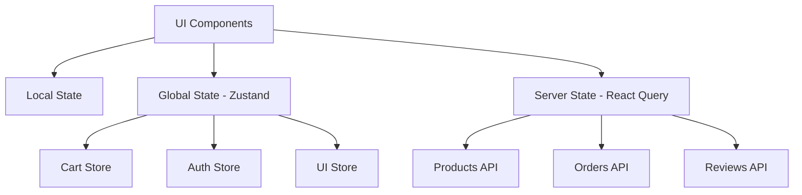

# Ve-Shop: Professional E-commerce Marketplace

**Ve-Shop** is a modern, feature-rich frontend-only e-commerce application built with React and TailwindCSS. Designed to rival major marketplaces like Amazon, Noon, and Jumia, it provides a comprehensive shopping experience with professional UI/UX, multi-language support, and extensive customization options.


## 🌟 Key Features

### 🛍️ Core E-commerce Functionality
- **Product Catalog**: Advanced browsing with multi-level categories and subcategories
- **Smart Search**: Full-text search with auto-complete and intelligent suggestions
- **Shopping Cart**: Complete cart management with quantity adjustments
- **Checkout Flow**: Streamlined checkout process with guest support
- **Product Reviews**: Comprehensive review and rating system
- **Wishlist**: Save favorite products for later
- **Order Management**: Order history, tracking, and invoice generation

### 🌍 Internationalization & Accessibility
- **Multi-language Support**: Arabic (RTL) and English (LTR) with instant switching
- **Theme System**: Dark and light modes with persistent user preference
- **Responsive Design**: Mobile-first approach with full device compatibility
- **WCAG Compliance**: Full accessibility standards implementation

### 🎨 Modern Design System
- **Professional UI**: Clean, trust-building design inspired by leading marketplaces
- **Design Tokens**: Consistent color system optimized for e-commerce
- **Smooth Animations**: Micro-interactions that enhance user experience
- **Component Library**: Reusable, customizable UI components

### 🔧 Technical Excellence
- **TypeScript**: Type-safe development with excellent IDE support
- **Modern React**: React 18+ with hooks and functional components
- **State Management**: Zustand for global state, React Query for server state
- **Performance Optimized**: Lazy loading, code splitting, and optimization techniques

## 🚀 Tech Stack

| Category | Technology | Purpose |
|----------|------------|---------|
| **Frontend** | React 18+ | UI framework |
| **Language** | TypeScript | Type safety and developer experience |
| **Styling** | TailwindCSS 3+ | Utility-first CSS framework |
| **UI Components** | shadcn/ui | Beautiful, accessible component library |
| **State Management** | Zustand | Simple, scalable state management |
| **Data Fetching** | TanStack Query | Server state management |
| **Routing** | React Router | Client-side routing |
| **Internationalization** | react-i18next | Multi-language support |
| **Build Tool** | Vite | Fast development and build |
| **Icons** | Lucide React | Consistent icon system |

## 📁 Project Structure

```
ve-shop/
├── src/
│   ├── components/           # Reusable UI components
│   │   ├── ui/              # Base UI components (shadcn/ui)
│   │   ├── layout/          # Layout components (Header, Footer, etc.)
│   │   ├── products/        # Product-related components
│   │   ├── cart/            # Shopping cart components
│   │   ├── auth/            # Authentication components
│   │   └── common/          # Common components
│   ├── features/            # Feature-based organization
│   │   ├── products/        # Product catalog feature
│   │   ├── cart/            # Shopping cart feature
│   │   ├── auth/            # Authentication feature
│   │   ├── orders/          # Order management feature
│   │   ├── reviews/         # Review system feature
│   │   └── admin/           # Admin panel feature
│   ├── hooks/               # Custom React hooks
│   ├── lib/                 # Utility functions and configurations
│   ├── store/               # Global state management
│   ├── types/               # TypeScript type definitions
│   ├── utils/               # Helper functions
│   ├── styles/              # Global styles and themes
│   ├── assets/              # Static assets (images, icons)
│   ├── pages/               # Page components
│   └── locales/             # i18n translation files
├── public/                  # Static public assets
├── docs/                    # Documentation
└── tests/                   # Test files
```

## 🛠️ Development Setup

### Prerequisites
- Node.js 18+ 
- npm, yarn, or pnpm

### Installation

1. **Clone the repository**
   ```bash
   git clone https://github.com/your-username/ve-shop.git
   cd ve-shop
   ```

2. **Install dependencies**
   ```bash
   npm install
   # or
   yarn install
   # or
   pnpm install
   ```

3. **Environment Configuration**
   ```bash
   cp .env.example .env
   ```
   
   Configure your environment variables:
   ```env
   # API Configuration
   VITE_API_BASE_URL=https://your-api-endpoint.com
   VITE_API_KEY=your-api-key
   
   # Payment Gateway (Optional)
   VITE_STRIPE_PUBLISHABLE_KEY=pk_test_...
   VITE_PAYPAL_CLIENT_ID=your-paypal-client-id
   
   # Analytics (Optional)
   VITE_GOOGLE_ANALYTICS_ID=GA_MEASUREMENT_ID
   
   # Feature Flags
   VITE_ENABLE_ANALYTICS=true
   VITE_ENABLE_REVIEWS=true
   VITE_ENABLE_WISHLIST=true
   ```

4. **Start development server**
   ```bash
   npm run dev
   ```

5. **Open browser**
   Navigate to `http://localhost:3000`

### Available Scripts

| Command | Description |
|---------|-------------|
| `npm run dev` | Start development server |
| `npm run build` | Build for production |
| `npm run preview` | Preview production build |
| `npm run lint` | Run ESLint |
| `npm run type-check` | Run TypeScript compiler |
| `npm run test` | Run unit tests |
| `npm run test:e2e` | Run end-to-end tests |

## 🎨 Design System

### Color Palette

```css
/* Primary Colors - Trust & Professional */
--primary: hsl(214, 84%, 56%)      /* Trust Blue */
--primary-hover: hsl(214, 84%, 46%) /* Darker Blue */

/* Secondary Colors - Action & Energy */
--secondary: hsl(25, 95%, 53%)      /* Action Orange */
--secondary-hover: hsl(25, 95%, 43%) /* Darker Orange */

/* Status Colors */
--success: hsl(142, 76%, 36%)       /* Success Green */
--warning: hsl(38, 92%, 50%)        /* Warning Yellow */
--destructive: hsl(0, 84%, 60%)     /* Error Red */

/* E-commerce Specific */
--price: hsl(142, 76%, 36%)         /* Price Green */
--sale: hsl(0, 84%, 60%)            /* Sale Red */
--rating: hsl(45, 93%, 47%)         /* Rating Gold */
```

### Typography

- **Headings**: Bold, clear hierarchy
- **Body**: Readable, optimized for e-commerce content
- **Buttons**: Action-oriented, clear CTAs

### Animations

- **Hover Effects**: Subtle lift and color transitions
- **Loading States**: Smooth skeleton loading
- **Page Transitions**: Fade and slide animations
- **Micro-interactions**: Button clicks, form interactions

## 🌍 Internationalization (i18n)

### Supported Languages
- **English (en)**: Left-to-right (LTR)
- **Arabic (ar)**: Right-to-left (RTL)

### RTL/LTR Implementation
```javascript
// Automatic direction switching
const direction = i18n.language === 'ar' ? 'rtl' : 'ltr';
document.documentElement.dir = direction;
```

### Adding New Languages
1. Create translation file in `src/locales/[lang].json`
2. Add language configuration in `src/lib/i18n.ts`
3. Update language selector component

## 🔐 Authentication System

### Supported Methods
- **Email/Password**: Traditional authentication
- **Social Login**: Google, Facebook, Twitter
- **OTP Authentication**: SMS and email verification
- **Guest Checkout**: No registration required

### Implementation
```typescript
// Authentication context
const { user, login, logout, register } = useAuth();

// Role-based access
const { hasPermission } = usePermissions();
```

## 💳 Payment Integration

### Supported Gateways
- **Stripe**: Credit cards, digital wallets
- **PayPal**: PayPal account and cards
- **Apple Pay**: iOS devices
- **Google Pay**: Android devices

### Implementation Pattern
```typescript
// Payment abstraction layer
interface PaymentProvider {
  initialize(config: PaymentConfig): Promise<void>;
  processPayment(amount: number, method: PaymentMethod): Promise<PaymentResult>;
  handleWebhook(data: WebhookData): Promise<void>;
}
```

## 📦 State Management

### Architecture


### Store Structure
```typescript
// Global state stores
interface AppState {
  cart: CartState;
  auth: AuthState;
  ui: UIState;
  preferences: PreferencesState;
}
```

## 🧪 Testing Strategy

### Testing Pyramid
1. **Unit Tests**: Component testing with Jest + React Testing Library
2. **Integration Tests**: Feature testing with user interactions
3. **E2E Tests**: Full user journey testing with Cypress
4. **Visual Tests**: Screenshot testing for UI consistency

### Critical Test Paths
- ✅ User registration and login
- ✅ Product search and filtering
- ✅ Add to cart functionality
- ✅ Checkout process
- ✅ Order completion
- ✅ Payment processing
- ✅ Responsive design

## 📈 Performance Optimization

### Implemented Strategies
- **Code Splitting**: Route-based and component-based splitting
- **Lazy Loading**: Images and non-critical components
- **Caching**: React Query for API response caching
- **Bundle Optimization**: Tree shaking and minification
- **Image Optimization**: WebP format and responsive images

### Performance Metrics Target
- **First Contentful Paint**: < 1.5s
- **Largest Contentful Paint**: < 2.5s
- **Cumulative Layout Shift**: < 0.1
- **Time to Interactive**: < 3s

## 🚀 Deployment

### Build Process
```bash
# Production build
npm run build

# Build analysis
npm run build:analyze

# Preview production build
npm run preview
```

### Deployment Platforms
- **Vercel**: Recommended for React applications
- **Netlify**: Great for static sites with edge functions
- **AWS S3 + CloudFront**: Enterprise-grade hosting
- **GitHub Pages**: Simple deployment for demos

### Environment Configuration
```bash
# Production environment variables
VITE_API_BASE_URL=https://api.ve-shop.com
VITE_STRIPE_PUBLISHABLE_KEY=pk_live_...
VITE_ENVIRONMENT=production
```

## 🗺️ Development Roadmap

### Phase 1: Foundation (Completed ✅)
- [x] Project setup and configuration
- [x] Design system implementation
- [x] Basic layout components (Header, Footer)
- [x] Product catalog and grid
- [x] Theme switching (Dark/Light)
- [x] Responsive design foundation

### Phase 2: Core E-commerce Features (4-6 weeks)
- [ ] **Authentication System** (Week 1-2)
  - [ ] Login/Register forms
  - [ ] Social authentication
  - [ ] Password recovery
  - [ ] Email verification
  - [ ] User profile management

- [ ] **Shopping Cart & Checkout** (Week 2-3)
  - [ ] Cart state management
  - [ ] Add/remove products
  - [ ] Quantity adjustments
  - [ ] Checkout form
  - [ ] Address management
  - [ ] Coupon system

- [ ] **Product Management** (Week 3-4)
  - [ ] Product detail pages
  - [ ] Image galleries with zoom
  - [ ] Product variants (size, color)
  - [ ] Category navigation
  - [ ] Advanced filtering
  - [ ] Product comparison

### Phase 3: Enhanced Features (3-4 weeks)
- [ ] **Search & Discovery** (Week 1)
  - [ ] Search functionality
  - [ ] Auto-complete
  - [ ] Search suggestions
  - [ ] Search history
  - [ ] Popular searches

- [ ] **Reviews & Ratings** (Week 2)
  - [ ] Review submission
  - [ ] Rating display
  - [ ] Review moderation
  - [ ] Helpful votes
  - [ ] Review photos

- [ ] **Order Management** (Week 3)
  - [ ] Order history
  - [ ] Order tracking
  - [ ] Order status updates
  - [ ] Invoice generation
  - [ ] Return/refund requests

### Phase 4: Advanced Features (4-6 weeks)
- [ ] **Multi-language Support** (Week 1-2)
  - [ ] i18n implementation
  - [ ] Arabic (RTL) support
  - [ ] Language switcher
  - [ ] Localized content
  - [ ] Currency conversion

- [ ] **Payment Integration** (Week 2-3)
  - [ ] Stripe integration
  - [ ] PayPal integration
  - [ ] Payment method storage
  - [ ] Subscription billing
  - [ ] Digital wallet support

- [ ] **Admin Panel** (Week 3-4)
  - [ ] Product management
  - [ ] Order management
  - [ ] User management
  - [ ] Analytics dashboard
  - [ ] Content management

### Phase 5: Optimization & Polish (2-3 weeks)
- [ ] **Performance Optimization** (Week 1)
  - [ ] Bundle optimization
  - [ ] Image optimization
  - [ ] Caching strategies
  - [ ] SEO improvements
  - [ ] Accessibility audit

- [ ] **Testing & Quality** (Week 2)
  - [ ] Unit test coverage
  - [ ] Integration tests
  - [ ] E2E test suite
  - [ ] Performance testing
  - [ ] Security audit

### Phase 6: Advanced Features (3-4 weeks)
- [ ] **Promotional System** (Week 1)
  - [ ] Flash deals
  - [ ] Promotional banners
  - [ ] Discount codes
  - [ ] Loyalty program
  - [ ] Affiliate system

- [ ] **Recommendations** (Week 2)
  - [ ] Related products
  - [ ] Recently viewed
  - [ ] Personalized recommendations
  - [ ] Cross-selling
  - [ ] Up-selling

- [ ] **Mobile App Features** (Week 3)
  - [ ] PWA implementation
  - [ ] Push notifications
  - [ ] Offline functionality
  - [ ] Mobile-specific features
  - [ ] App store optimization

## 🔧 Customization Guide

### Adding New Payment Providers
```typescript
// 1. Create provider class
class NewPaymentProvider implements PaymentProvider {
  async initialize(config: PaymentConfig) {
    // Implementation
  }
  
  async processPayment(amount: number, method: PaymentMethod) {
    // Implementation
  }
}

// 2. Register provider
paymentManager.registerProvider('newprovider', NewPaymentProvider);
```

### Adding New Product Categories
```typescript
// 1. Update category configuration
const categories = [
  {
    id: 'new-category',
    name: 'New Category',
    icon: 'icon-name',
    subcategories: [...]
  }
];

// 2. Update navigation components
// 3. Add category-specific filters
```

### Customizing Theme
```css
/* Override design tokens */
:root {
  --primary: hsl(your-custom-hue, saturation%, lightness%);
  --secondary: hsl(your-custom-hue, saturation%, lightness%);
}
```

## 🔒 Security Considerations

### Implemented Security Measures
- **Input Validation**: All user inputs are validated and sanitized
- **XSS Prevention**: Content Security Policy and output encoding
- **CSRF Protection**: Token-based CSRF protection
- **Authentication**: Secure token-based authentication
- **Data Encryption**: Sensitive data encryption in transit and at rest

### Security Checklist
- [ ] Regular dependency updates
- [ ] Security headers configuration
- [ ] API rate limiting
- [ ] Input validation and sanitization
- [ ] Secure authentication flow
- [ ] Payment data protection
- [ ] User data privacy compliance

## 📊 Analytics & Monitoring

### Integrated Analytics
- **User Behavior**: Page views, user journeys, conversion funnels
- **E-commerce**: Sales, revenue, product performance
- **Performance**: Page load times, error rates, user experience
- **Business**: Customer acquisition, retention, lifetime value

### Monitoring Setup
```typescript
// Analytics tracking
analytics.track('product_view', {
  productId: product.id,
  category: product.category,
  price: product.price
});

// Error monitoring
errorReporter.captureException(error, {
  user: currentUser,
  context: 'checkout_process'
});
```

## 🤝 Contributing

### Development Workflow
1. Fork the repository
2. Create a feature branch: `git checkout -b feature/amazing-feature`
3. Commit changes: `git commit -m 'Add amazing feature'`
4. Push to branch: `git push origin feature/amazing-feature`
5. Open a Pull Request

### Code Standards
- **TypeScript**: Strict mode enabled
- **ESLint**: Airbnb configuration with custom rules
- **Prettier**: Automatic code formatting
- **Husky**: Pre-commit hooks for quality checks

### Commit Convention
```
feat: add user authentication
fix: resolve cart total calculation
docs: update API documentation
style: format code with prettier
refactor: reorganize component structure
test: add unit tests for cart functionality
```

## 📄 License

This project is licensed under the MIT License - see the [LICENSE](LICENSE) file for details.

## 🙏 Acknowledgments

- **shadcn/ui**: Beautiful and accessible UI components
- **Tailwind CSS**: Utility-first CSS framework
- **React Team**: Amazing frontend framework
- **TypeScript Team**: Type safety and developer experience
- **Open Source Community**: All the amazing libraries and tools

## 📞 Support

### Getting Help
- **Documentation**: Check this README and inline code comments
- **Issues**: Create a GitHub issue for bugs or feature requests
- **Discussions**: Join our GitHub Discussions for questions
- **Email**: contact@ve-shop.com

### Community
- **Discord**: Join our Discord server
- **Twitter**: Follow @VeShopOfficial
- **Blog**: Read our development blog

---

## 🚀 Quick Start Example

```bash
# Clone and setup
git clone https://github.com/your-username/ve-shop.git
cd ve-shop
npm install

# Configure environment
cp .env.example .env
# Edit .env with your API endpoints

# Start development
npm run dev

# Build for production
npm run build
```

**Happy coding! 🛍️✨**